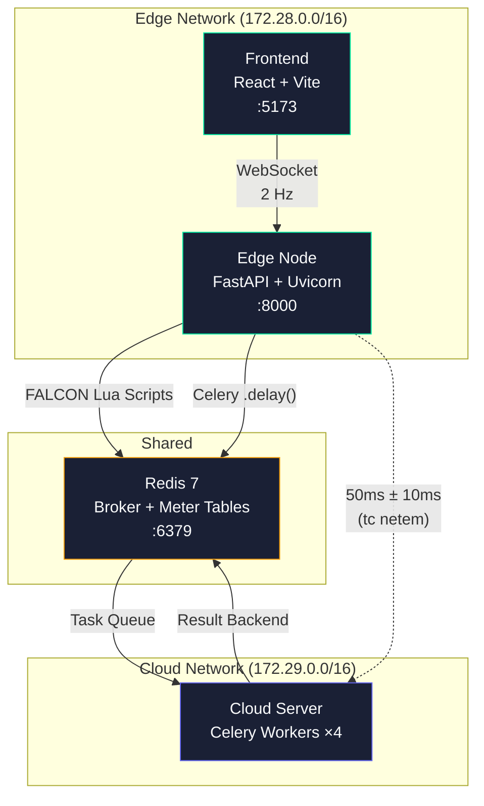

# TwinEdgeGrid — Smart Meter Edge-Aggregation Dashboard & Task Offloading Simulator

A production-grade MVP that validates the **Edge-Cloud Continuum** concept for IoT smart grids. Implements three foundational research algorithms as a containerized microservices stack with a real-time Digital Twin dashboard.

## Architecture



## Research Pipeline

| Layer | Algorithm | Paper | Implementation |
|-------|-----------|-------|----------------|
| **Step 1** | FALCON / D-FALCON | SDN bandwidth orchestration | Redis Lua middleware + background heuristic |
| **Step 2** | AuGrid LSTM | Load forecasting (lookback=2) | CPU-aware routing: edge < 80% → local, ≥ 80% → Celery cloud |
| **Step 3** | SmartPrice | Stackelberg game pricing | Reward factor + variable pricing + follower simulation |

## Quick Start

### Prerequisites
- Docker Desktop with WSL2 (for `tc` latency injection)
- Node.js 20+ (for frontend development)
- Python 3.12+ (for local backend development)

### Run with Docker Compose

```bash
# Copy environment template
cp .env.example .env

# Build and start all services
docker compose up --build

# Access:
#   Dashboard:  http://localhost:5173
#   API Docs:   http://localhost:8000/docs
#   Health:     http://localhost:8000/
```

### Local Development

```bash
# Backend
cd backend
pip install -e ".[dev]"
uvicorn app.main:app --reload --host 0.0.0.0 --port 8000

# Frontend (separate terminal)
cd frontend
npm install
npm run dev

# Redis (separate terminal)
docker run -d --name redis -p 6379:6379 redis:7-alpine

# Celery Worker (separate terminal)
cd backend
celery -A app.tasks.celery_app worker --loglevel=info
```

### Stress Test

```bash
cd backend
python scripts/traffic_generator.py --rate 200 --duration 60 --target http://localhost:8000
```

## Dashboard Panels

| Panel | Visualization | Validates |
|-------|---------------|-----------|
| **Edge-Cloud Continuum** | Dual CPU line chart + offload indicator | Dynamic task offloading at 80% threshold |
| **FALCON SDN Slicing** | Grouped bar chart + reallocation log | D-FALCON heuristic bandwidth orchestration |
| **AuGrid Forecasting** | Area chart (predicted vs actual) + RMSE | LSTM lookback=2 load prediction |
| **SmartPrice Market** | Prosumer data grid + KPI widgets | Stackelberg game cooperation enforcement |

## Tech Stack

| Component | Technology | Purpose |
|-----------|------------|---------|
| Backend | FastAPI + Uvicorn | Async API + WebSocket server |
| Task Queue | Celery + Redis | Edge → Cloud task offloading |
| Cache/Store | Redis 7 | SDN meter tables + message broker |
| ML Model | PyTorch LSTM | AuGrid load prediction |
| Frontend | React 18 + Vite | Digital Twin dashboard SPA |
| Charts | Recharts | Real-time data visualization |
| Containers | Docker Compose | Network isolation + latency simulation |

## Project Structure

```
TwinEdgeGrid MVP/
├── docker-compose.yml          # 4 services, 2 isolated networks
├── Dockerfile.edge             # Edge Node (single Uvicorn worker)
├── Dockerfile.cloud            # Cloud Server (Celery worker pool)
├── .env.example                # Configuration template
│
├── backend/
│   ├── app/
│   │   ├── main.py             # FastAPI app factory
│   │   ├── config.py           # Pydantic V2 Settings
│   │   ├── middleware/         # FALCON traffic police
│   │   ├── models/             # Pydantic schemas
│   │   ├── routers/            # API endpoints + WebSocket
│   │   ├── services/           # Business logic (FALCON, AuGrid, SmartPrice)
│   │   └── tasks/              # Celery tasks
│   ├── lstm/                   # PyTorch LSTM model
│   ├── scripts/                # Traffic generator
│   └── tests/                  # pytest-asyncio suite
│
└── frontend/
    └── src/
        ├── hooks/              # useWebSocket, useTelemetry
        ├── components/         # Dashboard panels (organisms)
        ├── pages/              # Dashboard page
        └── types/              # TypeScript interfaces
```

## License

MIT — Built for the TwinEdgeGrid SPARC-funded research project at IIT Indore.
