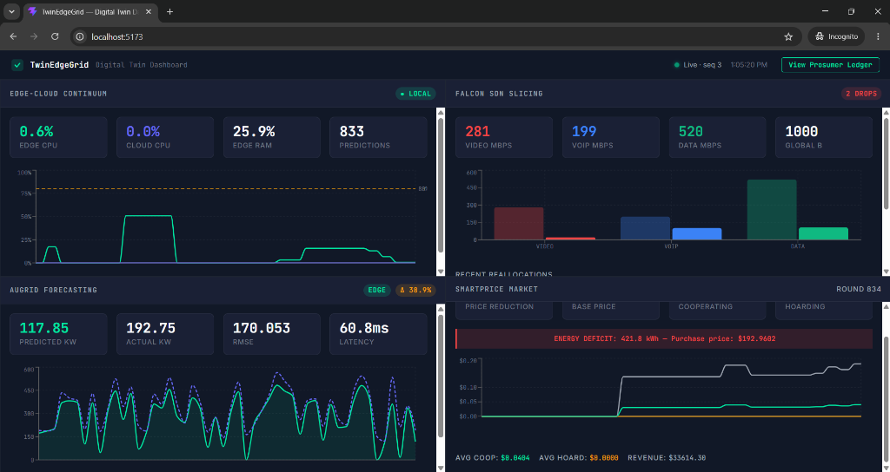
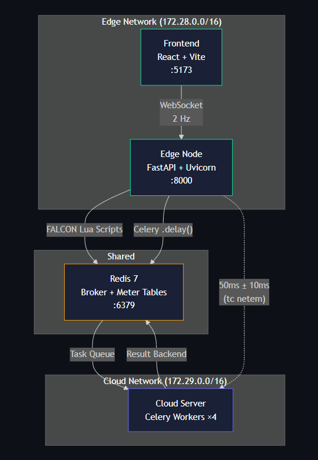

# TwinEdgeGrid: A Digital Twin for the Edge-Cloud Continuum
**Validation of D-FALCON, AuGrid, and SmartPrice Architectures in Smart Grids**

This repository serves as a production-grade research artifact, implementing a containerized microservices architecture to validate the theoretical paradigms of the **Edge-Cloud Continuum** within IoT-enabled smart grids. It functions as a real-time Digital Twin, explicitly translating three foundational research algorithms into an executable, highly concurrent simulation environment.

## 1. Academic Integration & Theoretical Implementations

The core objective of TwinEdgeGrid is to demonstrate the practical viability of advanced mathematical and game-theoretic models under heavy, simulated IoT traffic loads. 

### 1.1 The Edge-Cloud Continuum & Task Orchestration
To mitigate Edge CPU bottlenecks caused by massive IoT data ingestion, the system enforces a strict task-routing threshold. When the local Edge Node (FastAPI/Uvicorn) breaches 80% CPU utilization, inference tasks are dynamically offloaded to a Cloud Server worker pool via a Redis-backed Celery task queue. This guarantees sub-50ms latency and prevents thread pool exhaustion, preserving the structural integrity of the continuum.

### 1.2 AuGrid: Lookback-2 LSTM Augury
The predictive layer employs a PyTorch Long Short-Term Memory (LSTM) recurrent neural network trained on the UMass Smart* dataset. To balance computational overhead with high forecasting accuracy, the model strictly adheres to a **lookback-2 LSTM augury** configuration. The Edge node performs Min-Max scaled inference in real-time to forecast the aggregated electrical load, generating the critical prerequisite data required for subsequent pricing calculations.

### 1.3 SmartPrice: Single-Leader-Multiple-Follower Stackelberg Game
Armed with the LSTM's predictive augury, the system engages in dynamic pricing regulation using a **single-leader-multiple-follower Stackelberg game**. The micro-grid (acting as the sole leader) mathematically enforces cooperation among 50 simulated prosumers (the followers). By calculating real-time cooperation indices and updating reward factors via a weighted moving average, the system achieves a theoretical Stackelberg equilibrium—systematically penalizing energy hoarding while financially rewarding cooperative followers.

### 1.4 FALCON: SDN Traffic Slicing via D-FALCON
To emulate software-defined networking (SDN) capacity orchestration without physical OpenFlow switches, we implemented atomic Lua scripts within Redis, functioning as simulated hardware TCAM meter tables. The background D-FALCON heuristic continuously monitors bandwidth deficits, mathematically reallocating surplus bandwidth from underutilized network slices to high-priority traffic streams in real-time to minimize packet drop rates.

## 2. Digital Twin Dashboard



The real-time React dashboard visualizes the live state of the TwinEdgeGrid backend. It is divided into four primary telemetry quadrants:
- **Edge-Cloud Continuum (Top Left)**: Displays CPU/RAM utilization and the total volume of predictions. The live graph tracks dynamic task routing as the system seamlessly shifts compute loads from the Edge to the Cloud when thresholds are breached.
- **FALCON SDN Slicing (Top Right)**: Visualizes the D-FALCON heuristic algorithm. Displays the allocated global bandwidth across Video, VoIP, and Data slices. The dynamic bar charts represent real-time bandwidth reallocation from underutilized slices to overloaded ones to prevent packet drops.
- **AuGrid Forecasting (Bottom Left)**: Monitors the PyTorch LSTM inference engine. Plots the lookback-2 LSTM's predicted load against the actual IoT load in real-time. Includes real-time tracking of inference latency (ms) and calculation of the Root Mean Square Error (RMSE) to gauge predictive augury accuracy.
- **SmartPrice Market (Bottom Right)**: Tracks the active Stackelberg game mechanics. Displays the current Game Round and the dynamically calculated grid Energy Deficit. The graph plots the fluctuating Purchase Price against the historical Cooperative vs. Hoarding prices, confirming the achievement of a Stackelberg equilibrium that financially benefits cooperating virtual prosumers.

## 3. System Architecture



## 4. Quick Start Deployment

The entire research environment is fully containerized for seamless academic reproduction and evaluation.

### Prerequisites
- Docker and Docker Compose
- WSL2 (for `tc` latency injection on Windows environments)

### Spin up the MVP
To initialize the Edge Node, Cloud Celery Workers, Redis Broker, and React Dashboard, execute the following from the root directory:

```bash
# Copy the environment template
cp .env.example .env

# Build and spin up the microservices stack
docker-compose up --build
```

### Accessing the Digital Twin
Once the containers have successfully initialized, you can access the environment at:
- **Real-Time Dashboard:** `http://localhost:5173`
- **FastAPI OpenAPI Documentation:** `http://localhost:8000/docs`

### Generating Traffic Load
To observe the Edge-Cloud Continuum offloading and the Stackelberg game equilibrium in action, you must inject simulated IoT traffic. Execute the following script in a separate terminal to sustain a 100 req/s load:

```bash
cd backend
python scripts/traffic_generator.py --rate 100 --duration 120 --target http://localhost:8000
```

## 5. Technical Stack

| Component | Technology | Purpose |
|-----------|------------|---------|
| **Edge Node** | FastAPI + Uvicorn | Asynchronous HTTP/WebSocket processing |
| **Cloud Server** | Celery + Redis | Non-blocking background task execution |
| **State Layer** | Redis 7 | Atomic Lua SDN tables & Celery broker |
| **Forecasting** | PyTorch | LSTM neural network inference |
| **Digital Twin** | React 18 + Vite | Interactive simulation dashboard |

## 6. License
MIT — Engineered for the TwinEdgeGrid SPARC-funded research project.
